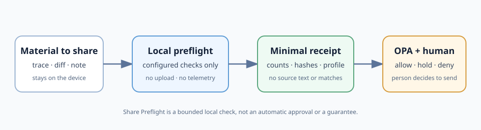

# Share Preflight

Small, local-first checks before you share text with an AI tool, issue tracker, chat, or external handoff.

It has two separate jobs:

1. inspect only the patterns you configure on your device; and
2. give [Open Policy Agent](https://www.openpolicyagent.org/) a **content-minimised** summary so it can return `allow`, `hold`, or `deny` from a named policy profile.

The original text, matching values, and local input/configuration paths are not included in the generated receipt or OPA input.

## When this is useful

Use this when someone is about to paste a production error, request trace,
pull-request diff, support note, or incident timeline into an external AI tool,
issue tracker, or chat.

The practical question is usually simple: **can this particular material go to
this particular destination under our current rules?** Share Preflight gives a
team a repeatable local check before that handoff. It is useful when the team
already knows which checks and destinations matter, but needs a small record of
which configured profile was used and what the policy decided.

It is not a universal secret scanner, automatic redactor, destination approval
system, or compliance sign-off. If the configured result is `hold` or `deny`,
do not forward the material automatically—resolve the missing condition with
the person or process responsible for the sharing decision.

## What happens in one run

1. Run configured local checks against the text you are considering sharing.
2. Create a receipt with counts, hashes, and profile facts—not the text,
   matching values, or local paths.
3. Pass that receipt to OPA for the named profile's `allow`, `hold`, or `deny`
   decision.
4. Keep the receipt with the handoff record; a person still decides whether to
   send the original material.



## Where it sits in the sharing workflow

Share Preflight is deliberately narrow. It is not a redactor that rewrites a
payload for onward transmission, and it is not a gateway that receives the
full request before forwarding it. It helps the person making the handoff
produce a local, content-minimised decision record first. That keeps policy
inputs reviewable without turning this tool into a claim that the source is
safe to disclose.

## A human review companion

Sometimes the policy result is not the whole decision. Before publishing a
status note or forwarding an AI-assisted answer, a reader may also want a short
prompt that separates what was directly observed, what the evidence supports,
and what remains unestablished. The free
[Claim-Scope Review Checklist](https://worldreader6.gumroad.com/l/mkebln) is a
human decision aid for that step.

It does not inspect text, run a policy, or replace this tool's configured
checks. Use it to frame the decision; use Share Preflight to create the
content-minimised receipt for the configured sharing boundary.

## Quick start

```sh
node share-preflight.mjs \
  --config example.config.json \
  --input examples/clean.txt \
  --facts examples/facts.json \
  --receipt /tmp/share-preflight-receipt.json \
  --opa-input /tmp/share-preflight-opa-input.json

opa eval --format=pretty \
  --data policy_profiles.json \
  --data profiled_sharing_gate.rego \
  --input /tmp/share-preflight-opa-input.json \
  'data.share_preflight.decision'
```

## Standard profile, adjustable policy

`standard-conservative-v01` is an editable, conservative starting point:

* public material can be allowed after the configured preflight passes;
* missing facts and unknown profiles hold for review;
* restricted material to an unapproved destination is denied.

The receipt retains only the input byte length and content hash, plus the
configuration hash and profile IDs. Keep your own mapping from those hashes to
local files if you need it; do not treat that mapping as shareable evidence.

Teams can add a separately named profile and adjust their data labels, approved destinations, and exception path. A profile should name its owner, record why it changed, and carry synthetic `allow`, `hold`, and `deny` examples. The free OSS does not lock this behind a paid tier.

## Optional OpenTelemetry evidence bridge

If an application already uses OpenTelemetry, it can attach a **content-minimised** Share Preflight receipt to an existing span. The optional mapper distinguishes the preflight result, provider-reported/estimated/unknown cost, and named task-specific evaluation rather than treating them as one generic "quality" claim.

See [the one-screen integration example](examples/otel-evidence-bridge.md). It adds no telemetry dependency to this project, does not export data, and does not put input text, matched values, receipt paths, prompts, or completions into the mapped attributes.

## Online-only delivery path

The OSS is useful on its own. If a team needs help, the compatible paid delivery is not a required meeting: it can be completed by email or an online form using only non-sensitive policy metadata. The deliverable can be a reviewed profile file, synthetic tests, an installation guide, and a content-minimised change receipt. Do not send source text, credentials, customer data, or a raw secret-scanner report for this setup.

Start with [`remote-profile-request.template.json`](remote-profile-request.template.json), replace the placeholders, and validate it locally:

```sh
node validate-remote-profile-request.mjs my-profile-request.json
```

`READY_FOR_PROFILE_TRANSLATION` means the request has the fields needed to draft a profile. It is not an approval, a security assessment, or a claim that the resulting profile is correct.

## What this does not claim

Share Preflight does not guarantee leak prevention, detect every sensitive-data type, detect all shadow AI use, certify compliance, or decide whether a classification is correct. A `PASS_WITHIN_CONFIGURED_SCOPE` result applies only to the checks you enabled. A responsible person decides whether material may be shared.

## Test

Requires Node.js and a local OPA binary.

```sh
node tests/verify.mjs
```

The test uses synthetic fixtures only. It proves deterministic behavior for those cases, not production effectiveness or user demand.
